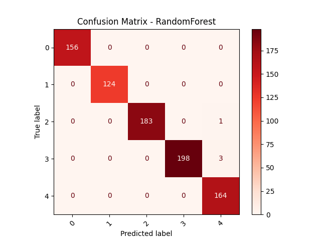
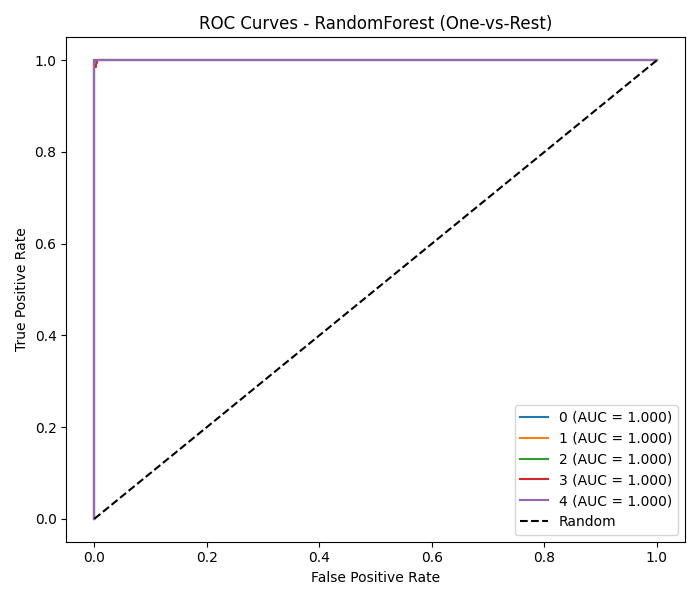

# Human activity recognition - Delivery 2 Report

1. **Data Preprocessing and Feature Engineering**

The initial dataset comprised raw pose landmark coordinates extracted using MediaPipe Pose from video recordings of various human activities. The preprocessing steps undertaken included:

- **Removal of Redundant Features**: Highly correlated features and those with low variance were identified and removed to reduce dimensionality and improve model performance.
- **Removal of useless data**: Columns that did not contribute to the classification task, such as frame indices and timestamps, were dropped.

2. **Model Training and Evaluation**

Three supervised learning algorithms were trained and evaluated to classify human activities based on pose landmark data: Random Forest, Support Vector Machine (SVM), and XGBoost.
Each model was implemented using a standardized pipeline that included feature scaling through StandardScaler and stratified data splitting (80% for training, 20% for testing).

To ensure robust evaluation and avoid overfitting, a 5-fold cross-validation procedure was applied on the training set. The cross-validation measured mean accuracy and standard deviation across folds to assess model stability.
Afterward, each model was tested on the held-out test set, and performance metrics such as accuracy, precision, recall, and F1-score were computed.

The table below summarizes the cross-validation results for each model:

| Model | Mean CV Accuracy | Std Deviation |
|-------|------------------|----------------|
| Random Forest | 0.9946 | 0.0028 |
| XGBoost | 0.9928 | 0.0034 |
| SVM | 0.9891 | 0.0029 |

The table below summarizes the test set performance for each model:

| Model | Accuracy | Precision | Recall | F1-Score |
|-------|----------|-----------|--------|----------|
| Random Forest | 0.9952 | 0.9953 | 0.9952 | 0.9952 |
| XGBoost | 0.9928 | 0.9929 | 0.9928 | 0.9928 |
| SVM | 0.9916 | 0.9916 | 0.9916 | 0.9916 |

The Random Forest model achieved the highest mean cross-validation accuracy (99.46%) with the lowest standard deviation, indicating excellent consistency across folds. The XGBoost model followed closely, showing similar performance but slightly higher variance. The SVM classifier also performed well but exhibited marginally lower accuracy.

These results confirm that the extracted features (joint coordinates, angles, inclinations, and derived biomechanical ratios) effectively capture differences among activities such as sit down, stand up, turn around, walk forward, and walk back.
The very small standard deviations (<0.004) across all models suggest that the dataset is well balanced and the models generalize consistently.

After selecting the Random forest model, it was evaluated further using confusion matrices and ROC-AUC scores to analyze class-wise performance and overall discriminative ability. The confusion matrix revealed minimal misclassifications, with most errors occurring between similar activities.

The images below illustrate the confusion matrix and ROC curves for the Random Forest model:

The ROC analysis (One-vs-Rest) showed AUC values above 0.98 for all classes, confirming high separability among activities. The Random Forest model demonstrated excellent discrimination ability, especially for turn_around and sit_down classes.

3. **Deployment Plan**

A lightweight real-time recognition application will be developed:

Input: live video stream (webcam).

Pose extraction: MediaPipe Pose for landmark detection.

Prediction: trained Random Forest model.

Output: detected activity displayed on screen in real time.

Deployment options:

Local execution (Python + OpenCV).

Future integration into a web app via FastAPI or Streamlit, enabling interactive use.

4. **Impact Analysis**

Implementing this system has direct implications in:

Education and ergonomics: posture monitoring, sports performance feedback.

Healthcare: rehabilitation, fall detection for elderly users.

Human–computer interaction: gesture-based control and adaptive interfaces.

From an ethical perspective, the solution follows the principles of transparency, fairness, and privacy protection:

Only skeletal pose landmarks are stored (no identifiable imagery).

All data collected under informed consent.

No use of the model for surveillance or identity tracking.